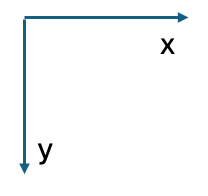

# TinyRenderer

 - [X] 0. getting started
 - [ ] 1. Bresenham’s Line Drawing Algorithm
 - [ ] 2. Triangle rasterization and back face culling
 - [ ] 3. Hidden faces removal (z buffer)
 - [ ] 4. Perspective projection
 - [ ] 5. Moving the camera
 - [ ] 6. Shaders for the software renderer
 - [ ] 6bis. tangent space normal mapping
 - [ ] 7. Shadow mapping
 - [ ] 8. Ambient occlusion
 - [ ] 9. Real OpenGL (GLSL) application

## 0. getting started

pixel의 color를 바꾸는 함수 제공

좌표 평면

<!-- 1. Bresenham’s Line Drawing Algorithm -->
<!-- 2. Triangle rasterization and back face culling -->
<!-- 3. Hidden faces removal (z buffer) -->
<!-- 4. Perspective projection -->
<!-- 5. Moving the camera -->
<!-- 6. Shaders for the software renderer -->
<!-- s. tangent space normal mapping -->
<!-- 7. Shadow mapping -->
<!-- 8. Ambient occlusion -->
<!-- 9. Real OpenGL (GLSL) application -->